# Design-patterns

## Constructor
+ First step in order to execute the correct file with node: 
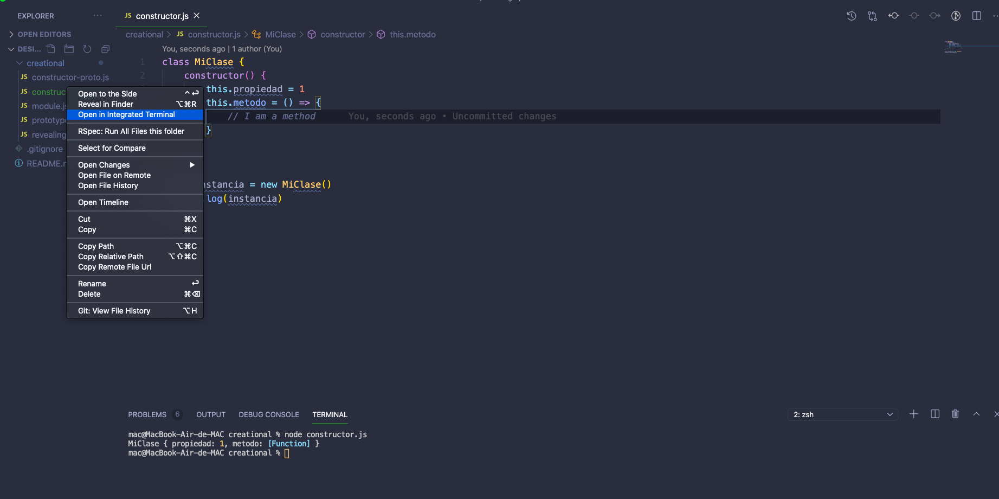
+ You can add values or dependencies that will be returned as properties
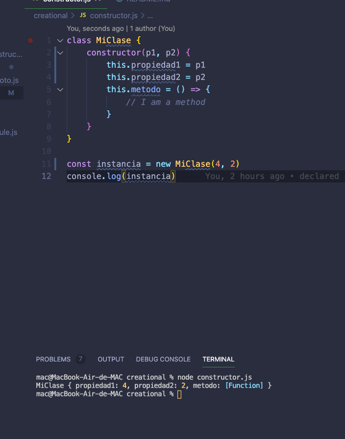

## Prototype-Constructor
+ The main difference with Constructor is that methods nor properties wouldn't be storage, copy, at every instance of the new object, if methods and props are assigned to prototype properly. An advantage could be that you will use, with this pattern, less space in memory.

+ Add some changes to original code
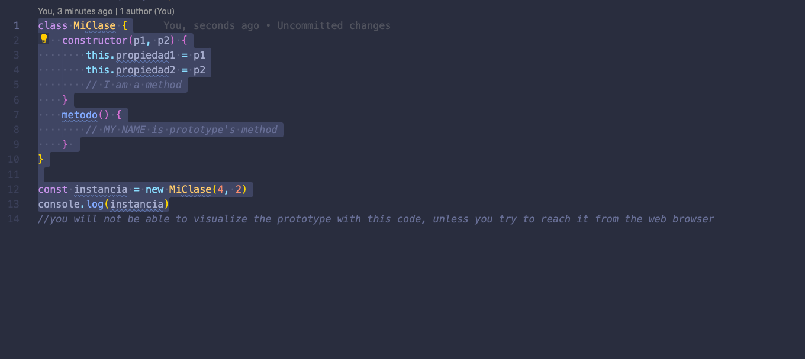
+ Then, copy and paste at the console from the browser
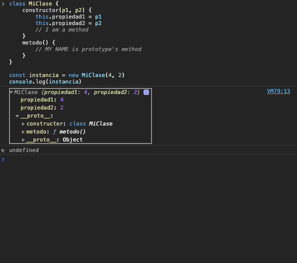
+ Now you can see your function... not only that
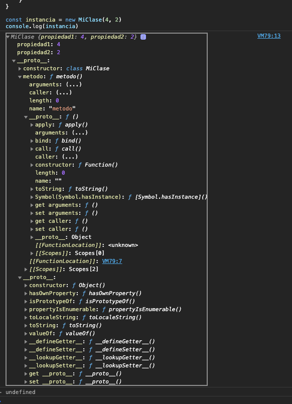

+ Building our first example: 
+ This class will be added to all objects that we eventually create with JS, it'll extends Object's class. In this case log method was added to prototype and that'll be equal to a function (do NOT use fat arrow function here). 'This' at the console references to Object. X being our new object.
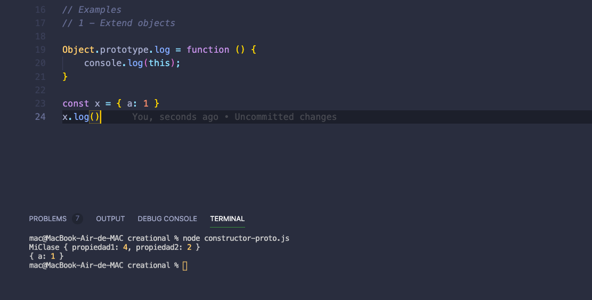

+ Building second example:
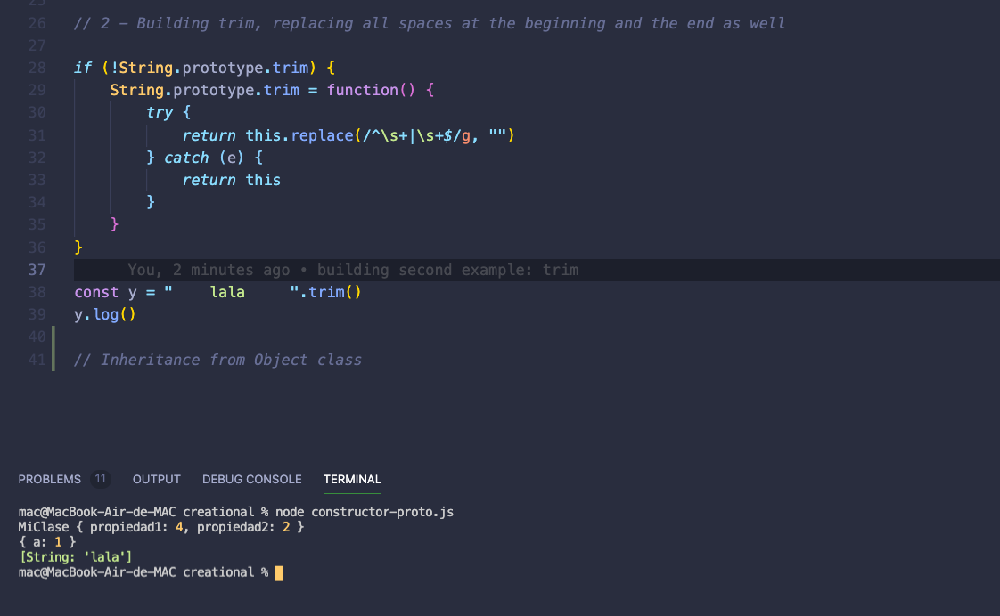
At this point, we clearly see that String is inheriting from Object class. Here the regular expression was added to erase space at the beginning and the end, in the case if .trim does not run at the browser, because is not supported in some versions.

## Module
+ It's based on literal JavaScript's objects. In other words, every time you define a literal object in JavaScript you'll be defining a module; which could contain properties and at the same time, this properties could contain objects and methods as well:
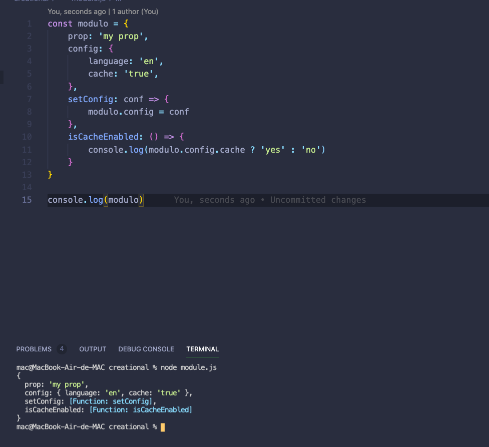
+ In this example you can also ask for the state of 'modulo'

## Revealing module
+ The main difference with Module is that Revealing Module contains a public and private API. The benefit of this is that you can avoid classical syntax and replacing it for a function to create a module. Also you can use *[IIFE](https://developer.mozilla.org/en-US/docs/Glossary/IIFE "IIFE (Immediately Invoked Function Expression)")*.
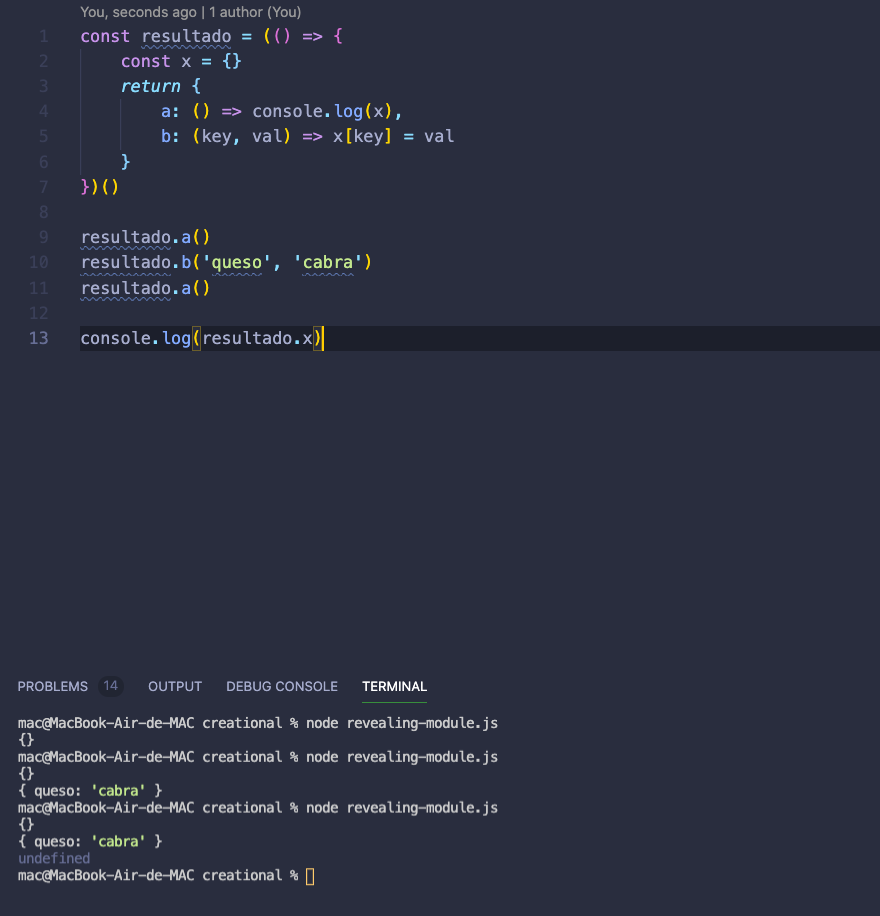
+ The example above contains an *[IIFE](https://developer.mozilla.org/en-US/docs/Glossary/IIFE "IIFE (Immediately Invoked Function Expression)")*, inside of it we define private constants and we will return things that we provide for x developer to read properly. 
+ As shown above we can establish a new property 'queso' and its value 'cabra'. Nonetheless, you won't be able to access to the const x because only methods could have an access to this private API. In this case will be 'a' or 'b' or whatever that is returned. You can also use the public API to modify the private API.
+ *Example using revealing module:* Creating an intermediate layer that will allows us to create resources that will be storage at an API, which means that we will create a module that enable us to save data at user's API. Also, the same logic will be applied but this time with products and so on and so on.
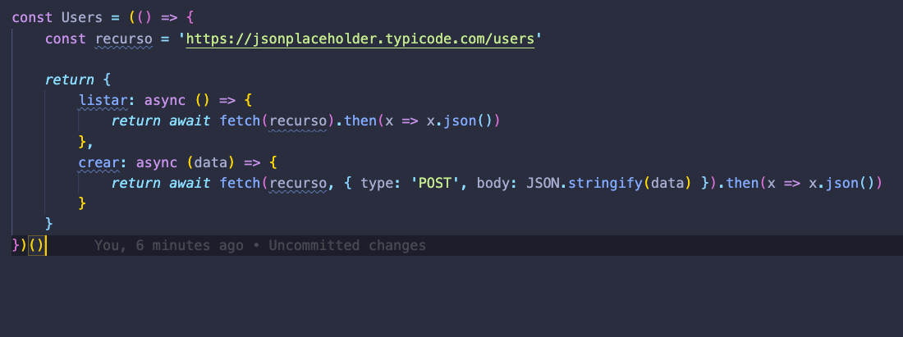
THIS code won't work unless we copy and paste it at the browser:
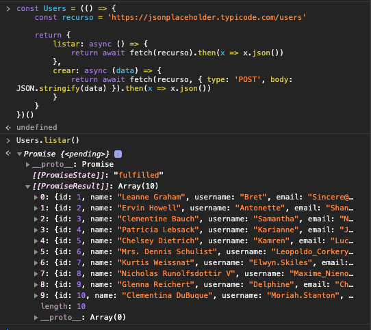

## Prototype

+ The prototype-pattern it's based on the fact that we can take an object, that is already defined, and add a new prototype based on that fact. These new prototypes are generated for another object, eliminating duplication of code.
+ An example:
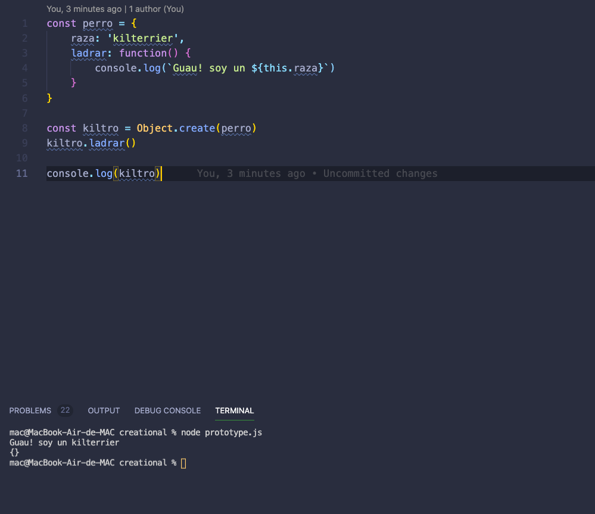
+ IMPORTANT: you can't use fat arrow function here because it hasn't context of 'this.'. Also, you have to use 'Object.create', which will create a new object out of nowhere BUT the argument that its provided will be the prototype as is shown above.
+ 'console.log(kiltro)' returns an empty object because properties and methods are storage inside the prototype.
+ The main value of this is that you can replace properties and methods(not included) as is shown:
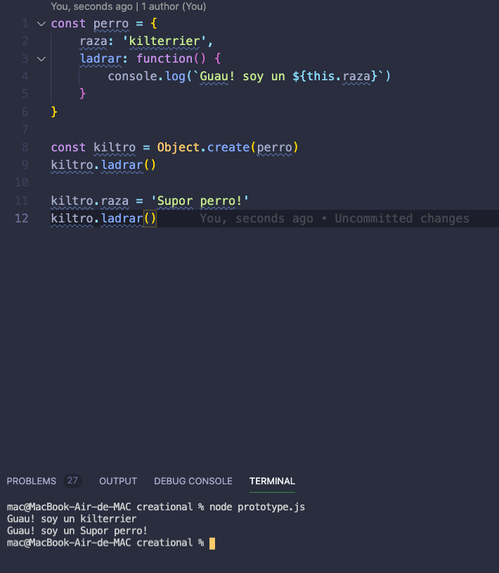

## Closures
+ Even though they are not patterns it is strictly necessary to add some comments on it:
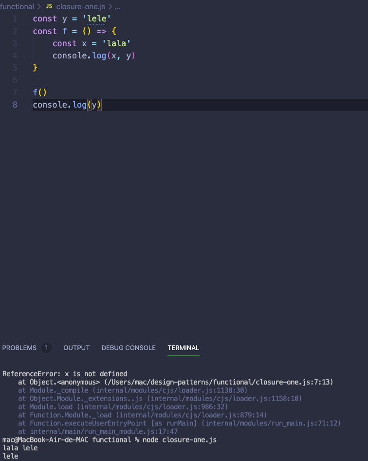
+ First thing that must call our attention is the scope. The lexical function's scope are of two types; which are private and global. Private is what it's surrounded by { }. Global scope would be what is outside the { } independently which side is it.  
+ So, why do we get this error? :
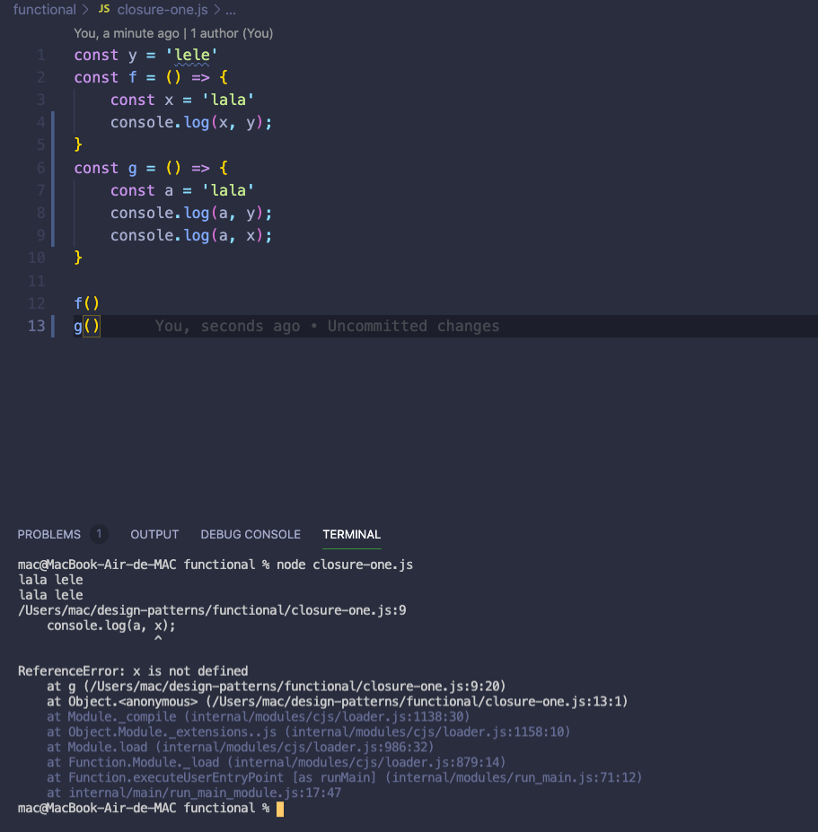
The error occurs because it out it's scope, when you call 'y' this resides at the global scope. You won't be able to react it from it.
+ In the following example we'll be able to access all constants, but why?
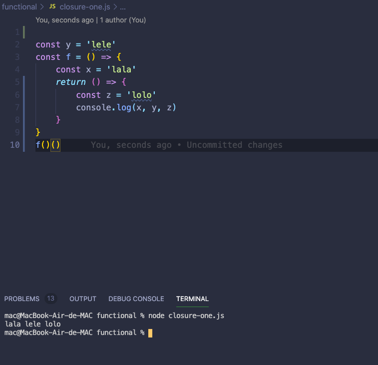
Constant 'f' couldn't react constant 'z' but when we call it again with () we do have an access...
+ Here the second function could take the values of the first function and add some logic to it.
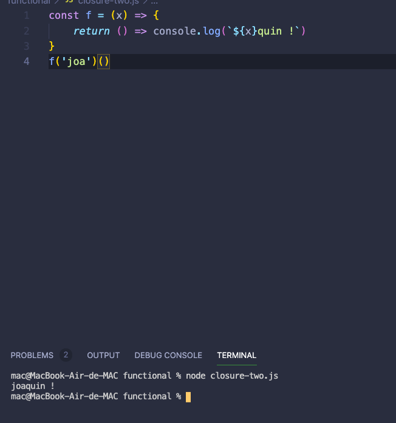